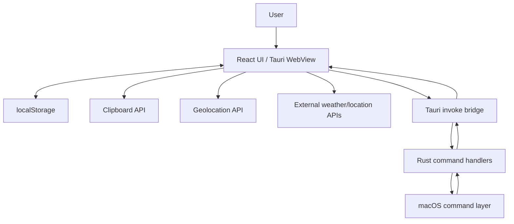

# Data Flow and Trust Boundaries

## Overview

Port Scanner is a local macOS desktop app, but it still crosses several trust boundaries: the Tauri WebView, the Rust backend, local OS commands, local browser APIs, external weather/location services, and GitHub release infrastructure.

This document describes the runtime data flows and the boundaries that matter for safety and maintenance.

## Primary runtime boundaries

## Frontend-to-backend command boundary

The frontend invokes backend commands with `@tauri-apps/api/core`:

- `list_listeners`
- `list_listeners_admin`
- `list_processes`
- `get_system_metrics`
- `kill_pid`
- `open_url`

This is the most important application trust boundary. The frontend is responsible for user interaction and data shaping; the backend is responsible for local OS authority. Sensitive actions must not rely only on UI controls.

The current backend guardrail is `KnownPids`, a `Mutex<HashSet<u32>>` of PIDs from the latest scan. `kill_pid` rejects PIDs that are not in that allowlist before running `/bin/kill -9`.

## Local OS command boundary

The Rust backend executes local macOS commands:

| Command | Data returned or action performed | Sensitivity |
|---|---|---|
| `lsof -n -P -iTCP -sTCP:LISTEN` | Listener process names, PIDs, bind addresses, ports. | Reveals local services and PIDs. |
| `lsof -Fn -d cwd -p <pids>` | Working directories for selected PIDs. | Reveals local filesystem paths and project names. |
| `ps -ax -o pid=,etime=` | PIDs and process uptimes. | Reveals process metadata. |
| `ps -axww -o pid=,command=` / `pid=,etime=,command=` | Full command lines. | May reveal arguments, paths, or secrets passed on command lines. |
| `sysctl -n hw.memsize` | Total memory. | Low sensitivity system metadata. |
| `vm_stat` | Memory page counters. | Low sensitivity system metadata. |
| `df -k /` | Root disk usage. | Low sensitivity system metadata. |
| `open <url>` | Opens a local URL or repository URL. | Launches external app/browser. |
| `/bin/kill -9 <pid>` | Terminates a process. | Destructive local action. |
| `osascript` admin `lsof` | Elevated listener discovery. | Prompts for administrator privileges. |

Because process command lines and cwd paths can contain sensitive local information, exports should be treated as local diagnostic artifacts and not uploaded or shared casually.

## Persistence boundary

The app stores preferences locally in the WebView's localStorage under `port-scanner-settings-v1`:

- Protected listener row keys.
- Preferred open scheme (`http` or `https`).
- Optional open path.
- Auto-refresh interval.
- Skip kill confirmation flag.

Weather data is cached separately under `port-scanner-weather-v1` with a two-hour maximum age.

These values are not synced to GitHub or a server by this app. Clearing local app/site data removes them.

## External network boundary

The core port/process/system scanning feature is local. The current frontend also includes an optional weather panel:

1. It asks the browser geolocation API for coordinates when available.
2. If geolocation is unavailable or denied, it falls back to `https://ipapi.co/json/` for approximate latitude/longitude.
3. It requests current weather from `https://api.open-meteo.com/v1/forecast`.
4. It caches the returned weather snapshot locally.

This means enabling weather can disclose approximate or precise location to browser/geolocation providers and weather/location APIs. Port/process scan data is not sent to these services by the inspected code.

## Clipboard and export boundary

Copy actions write tab-separated row data to the system clipboard. Exports generate CSV or JSON files in the WebView and download them locally.

Potentially sensitive fields in copied/exported data include:

- Process names and PIDs.
- Ports and bind addresses.
- Full command lines.
- Project folder names and cwd paths.
- Uptime values.
- System metrics.

## Destructive-action boundary

Killing a process crosses from inspection into destructive local control.

Current safeguards:

- Listener rows can be protected with 🛡, which disables Kill for that exact `(pid, port, address)` key in the frontend.
- Kill confirmation is enabled by default.
- Users may opt into skipping confirmation in settings.
- Backend `KnownPids` rejects PIDs not observed in the latest backend scan.
- UI removes successfully killed rows after a short delay.

Residual risk:

- `kill -9` is forceful and can cause data loss in the target process.
- Process IDs can be reused by the operating system; refreshing before killing reduces stale-state risk.
- A process may require elevated privileges and fail to terminate.

## Admin scan boundary

Admin scan calls AppleScript with administrator privileges for the `lsof` listener scan. It can reveal listeners hidden from normal user-level `lsof`. The user receives a macOS password prompt. Cancellation or failure returns an error to the UI.

Admin scan does not make all enrichment elevated: cwd lookup still runs as the current user, and the README notes that system PIDs may simply lack project labels.

## Build and release boundary

GitHub Actions builds on `macos-14`, runs quality gates, uploads `.app` artifacts for CI, and creates release zips on `v*` tags. Current builds are not code-signed or notarized unless signing secrets and steps are added later.

Unsigned downloaded apps can trigger Gatekeeper warnings.

## Generated/local wiki note

`library/knowledge-base/wiki/` is generated/local and currently ignored. It should not be used as the tracked source of truth for these trust-boundary docs.

## Source references

- `src/App.tsx`
- `src/prefs.ts`
- `src-tauri/src/lib.rs`
- `src-tauri/tauri.conf.json`
- `.github/workflows/build-macos.yml`
- `.github/workflows/release-macos.yml`
- `README.md`
- `STATUS.md`
