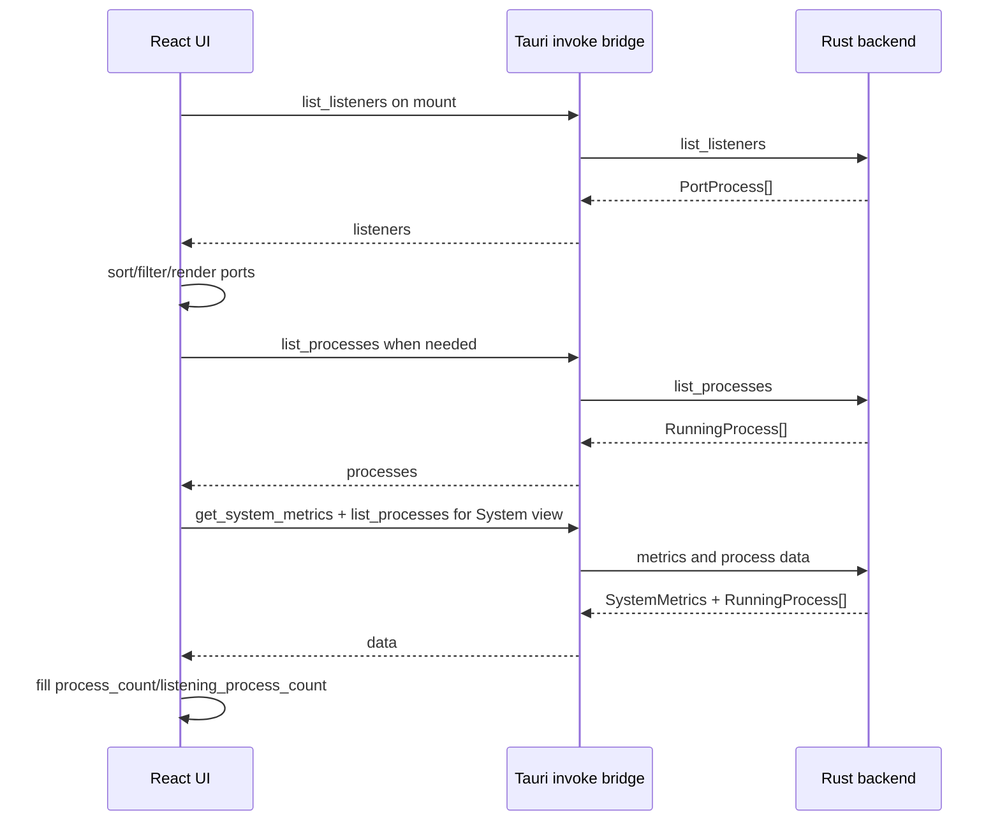

# Frontend Architecture

## Overview

The Port Scanner frontend is a Vite + React 19 + TypeScript application rendered inside a Tauri WebView. The entire interactive application is currently implemented in `src/App.tsx`, with persisted preference helpers in `src/prefs.ts` and styling in `src/App.css`.

`src/main.tsx` mounts the React tree:

```tsx
ReactDOM.createRoot(document.getElementById("root") as HTMLElement).render(
  <React.StrictMode>
    <App />
  </React.StrictMode>,
);
```

## Responsibilities

The frontend owns:

- View switching between `listeners`, `processes`, and `system` modes.
- Calling Tauri commands through `invoke`.
- In-memory state for scan results, loading/errors, selected rows, sort state, kill state, pending confirmation, toast state, and weather state.
- Local persistence for user preferences and protected listener rows.
- Filtering and sorting in the WebView after scans return.
- CSV/JSON export generation for the currently visible filtered data.
- Browser/system API interactions that do not require Rust: localStorage, Clipboard API, geolocation, fetch, and Blob downloads.
- Presentation, responsive layout, modals, dashboard/MFD panels, tables, toasts, and empty states.

## Core TypeScript models

`src/App.tsx` defines frontend mirrors of backend payloads:

- `PortProcess` — listener row with `name`, `pid`, `port`, `address`, optional `command`, `project`, `cwd`, and `uptime`.
- `RunningProcess` — process row with `name`, `pid`, `command`, optional `project`, `cwd`, `uptime`, and `listener_addresses`.
- `SystemMetrics` — memory, disk, total process count, and listening-process count.
- `WeatherSnapshot` / `WeatherState` — optional local weather panel state.
- `ViewMode` — `listeners`, `processes`, or `system`.
- `KillTarget` — either a `PortProcess` or `RunningProcess`.

`src/prefs.ts` defines `AppSettings`:

- `protectedRowKeys: string[]`
- `openScheme: "http" | "https"`
- `openPath: string`
- `autoRefreshSec: number`
- `skipKillConfirm: boolean`

Settings are stored under localStorage key `port-scanner-settings-v1`.

## Tauri command calls

The frontend calls these Rust commands through `@tauri-apps/api/core` `invoke`:

- `list_listeners` — normal TCP listener scan.
- `list_listeners_admin` — admin listener scan through AppleScript.
- `list_processes` — full process scan with listener enrichment.
- `get_system_metrics` — memory and disk metrics.
- `kill_pid` — allowlist-guarded SIGKILL.
- `open_url` — open a URL with macOS `open`.

The command boundaries are explicit in `scan`, `scanRunningProcesses`, `scanSystem`, `runKill`, row open actions, and the title-bar repo link action.

## Data loading behavior



On initial mount the app performs a normal listener scan. Process data is loaded when needed; if process data is empty, the frontend triggers a background process scan. System view requests metrics and process rows; the frontend uses the process rows to populate process counts and avoid a duplicate listener scan for counts.

## Filtering and sorting

Filtering is token-based and case-insensitive. The helper functions normalize text with NFKD, remove diacritics, lower-case, trim, split into tokens, and require every query token to appear in the assembled search text.

Listener search fields include process name, PID, port, formatted bind, raw address, command, project, cwd, and uptime. Process search fields include process name, PID, command, project, cwd, uptime, listener addresses, and listener count.

Sorting is performed client-side:

- Listener sort keys: process, PID, port, bind, open/uptime.
- Process sort keys: process, PID, command, open/uptime, listener count.
- Re-clicking an active column toggles ascending/descending; choosing a new column starts ascending.

## Persistence

`src/prefs.ts` makes preference persistence best-effort and safe:

- Loading falls back to defaults when `window` is unavailable, the key is absent, JSON parsing fails, or field values are invalid.
- Saving catches localStorage failures so in-memory settings can still apply.
- `protectedRowKeys` are sanitized to string arrays.
- `openScheme` is constrained to `http` or `https`.

The weather panel also caches weather data in localStorage under `port-scanner-weather-v1` with a two-hour maximum age. Weather uses geolocation when available and falls back to approximate IP location through `ipapi.co`, then fetches weather from `open-meteo`.

## Export behavior

Exports are generated in the frontend and only include the current visible filtered rows.

- Listener CSV/JSON exports one record per visible listener.
- Process CSV/JSON exports one record per visible process.
- System CSV/JSON exports metrics plus visible process rows.

The CSV helpers quote fields and double embedded quotes. Downloads are created with `Blob`, object URLs, and timestamped filenames.

## UI structure and styling

`src/App.css` defines the entire cockpit-style UI. Major surface areas include:

- Header with app title, repo link, weather panel, settings, refresh, and admin scan.
- Cockpit dashboard with active mode, stat cards, and status chips.
- Toolbar with view switcher, filter, auto-refresh, pause, and export controls.
- Tactical MFD panels for ports and processes.
- Empty/loading states.
- Optional uptime chart for listeners.
- System metrics cards.
- Process/listener table.
- Kill confirmation and settings modals.
- Toast feedback.

The CSS uses custom properties for colors, fonts, surfaces, borders, and cockpit accents; it includes responsive behavior for smaller widths and heights.

## Source references

- `src/main.tsx`
- `src/App.tsx`
- `src/prefs.ts`
- `src/App.css`
- `package.json`
